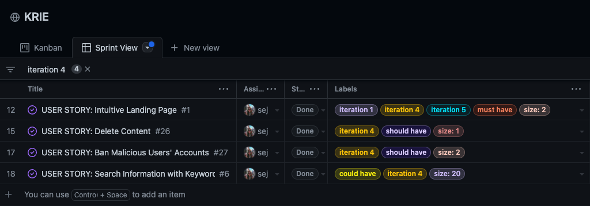

# KRIE

_KRIE_ is a website for Korean people living in Ireland to share information about visas, accomodation, work and so on. All the users can view the posts and comments without registration and the registered users can write posts and comments.


### View the live project [here](https://krie.herokuapp.com/)

__Note__: The site is for educational purposes only and written in English.

<br>

# Table of Contents

[User Experience (UX)](#user-experience-ux)
- [Project Manifesto](#project-manifesto)
- [Website Name](#website-name)
- [Website Goal](#website-goal)
- [Target Audience](#target-audience)
- [User Stories](#user-stories)
- [Design](#design)
- [Wireframes](#wireframes)

[Database Model](#database-model)
- [Database](#database)
- [Entity Relationship Diagram](#entity-relationship-diagram)
- [Models](#models)

[Agile methodology](#agile-methodology)
- [MoSCoW method and story points](#moscow-method-and-story-points)
- [Iterations](#iterations)

[Features](#features)
- [Implemented Features](#implemented-features)
- [Features Left to Implement](#features-left-to-implement)

[Technologies Used](#technologies-used)
- [Languages](#languages)
- [Framework](#framework)
- [Programs](#programs)

[Testing](#testing)
- [Testing User Stories](#testing-user-stories-from-the-user-experience-ux-section)
- [Code Validation](#code-validation)
- [Functionality Testing](#functionality-testing)
- [Performance Testing](#performance-testing)
- [Bugs](#bugs)

[Deployment](#deployment)
- [Heroku](#heroku)
- [Making a Local Clone](#making-a-local-clone)
- [Forking this Repository](#forking-this-repository)

[Credits](#credits)
- [Code](#code)
- [Content](#content)
- [Acknowledgements](#acknowledgements)

<br>

# User Experience (UX)

## Project Manifesto

There are very few platforms that are used by Koreans in Ireland. A _Facebook_ page, _Daum_ cafe and _Kakaotalk_ group chat are all that are available. The first two are managed by language school agencies and have become inactive and the latter is the most active platform but there are some limitations, such as anyone who wants to join needs to be invited by one of the members as it is a private group, and a new member will have a difficult time trying to find information that was posted before they joined the chat. This project is intended to overcome all of these flaws with the current platforms.

## Website Name

_KRIE_ comes from the country code top-level domains for South Korea and Ireland: .kr and .ie.

## Website Goal

To provide a platform where a user can easily find information and interact with others.

## Target Audience

- Korean people who are planning to live or currently living in Ireland.
- Other nationality people who are interested in interacting with Korean people in Ireland.

## User Stories

- As a first-time visitor,
    - [#1](https://github.com/sejungkwak/krie/issues/1) I want to know what this site is about immediately so that I can decide whether I will explore further.
    - [#2](https://github.com/sejungkwak/krie/issues/2) I want to navigate pages so that I can understand what types of information I could find here.

<br>

- As an unregistered user,
    - [#3](https://github.com/sejungkwak/krie/issues/3) I want to view a list of posts' titles so that I can choose which one to read.
    - [#4](https://github.com/sejungkwak/krie/issues/4) I want to order the posts by their number of likes so that I can see which is the most popular.
    - [#5](https://github.com/sejungkwak/krie/issues/5) I want to view comments on an individual post so that I can read the conversation.
    - [#6](https://github.com/sejungkwak/krie/issues/6) I want to search for information with keywords so that I can easily find information that is useful and relevant to me.
    - [#7](https://github.com/sejungkwak/krie/issues/7) I want to sign up so that I can write posts, comment and give a like to other users' posts.
    - [#8](https://github.com/sejungkwak/krie/issues/8) I want to sign up with my _Google_ or _Facebook_ account so that I can easily sign in.

<br>

- As a registered user,
    - [#9](https://github.com/sejungkwak/krie/issues/9) I want to create a post to ask about others' recent experiences with the immigration office so that I can prepare for my upcoming appointment.
    - [#10](https://github.com/sejungkwak/krie/issues/10) I want to create a draft post so that I can continue it at a later date.
    - [#11](https://github.com/sejungkwak/krie/issues/11) I want to leave comments on a post so that I can be involved in the conversation.
    - [#12](https://github.com/sejungkwak/krie/issues/12) I want to leave secret comments with any sensitive information directly visible to the original poster so that I can comfortably share it.
    - [#13](https://github.com/sejungkwak/krie/issues/13) I want to send direct messages to other users so that I can interact with them privately.
    - [#14](https://github.com/sejungkwak/krie/issues/14) I want to give a like to a post so that I can highlight useful content for other users.
    - [#15](https://github.com/sejungkwak/krie/issues/15) I want to remove a like from a post so that I can ensure that I only give it to the content I feel is useful.
    - [#16](https://github.com/sejungkwak/krie/issues/16) I want to edit my post so that I can correct any mistakes or update other users with new information.
    - [#17](https://github.com/sejungkwak/krie/issues/17) I want to delete my post if no one answers my question so that I can maintain a clean profile.
    - [#18](https://github.com/sejungkwak/krie/issues/18) I want to see another user's posts and comments by clicking the username so that I can decide if the user is trustworthy.
    - [#19](https://github.com/sejungkwak/krie/issues/19) I want to see what posts I marked with a like so that I can easily find the post again.
    - [#20](https://github.com/sejungkwak/krie/issues/20) I want to get notified when there is a new comment on my posts so that I can follow up.
    - [#21](https://github.com/sejungkwak/krie/issues/21) I want to sign in and sign out of my account with my credentials so that I can keep my account secure.
    - [#22](https://github.com/sejungkwak/krie/issues/22) I want to update my password so that I can keep my account secure.
    - [#23](https://github.com/sejungkwak/krie/issues/23) I want to reset my password so that I can access my account even if I forget it.
    - [#35](https://github.com/sejungkwak/krie/issues/35) I want to update my profile so that I can keep my information up to date.
    - [#36](https://github.com/sejungkwak/krie/issues/36) I want to get feedback so that I can ensure that I have interacted with the website correctly.

<br>

- As a superuser,
    - [#24](https://github.com/sejungkwak/krie/issues/24) I want to pin important posts so that users can easily view them.
    - [#25](https://github.com/sejungkwak/krie/issues/25) I want to create a category when needed so that I can manage the site effectively.
    - [#26](https://github.com/sejungkwak/krie/issues/26) I want to delete content when inappropriate so that I can maintain the site and ensure that only useful or relevant content remains.
    - [#27](https://github.com/sejungkwak/krie/issues/27) I want to ban scammers'/spammers' accounts so that I can ensure only trusted users can access the site.

<br>

## Design

- Colour Scheme

    The colour scheme has been created based on the Korean and Irish flags. The chosen colours were selected using [_Canva_](https://www.canva.com/).

    <details>
    <summary>View the colour scheme</summary>

    

    </details>

<br>

- Typography

    [Gothic A1](https://fonts.google.com/specimen/Gothic+A1) is the main font used throughout the whole website with Sans Serif as the fallback font in case the font isn't imported into the browser correctly.

    I have chosen the font with the criteria below in mind:

    - It supports Korean characters.
    - It gives a neutral emotional response to the reader.
    - It has a readable body typeface.
    - It has a variety of weights and styles.

- Logo

    

- Favicon

    

<br>

## Wireframes

<details>
    <summary>Homepage</summary>
    
</details>

<details>
    <summary>Sign in</summary>
    
</details>

<details>
    <summary>Sign up</summary>
    
</details>

<details>
    <summary>Profile</summary>
    
    
    
    
    
</details>

<details>
    <summary>Post list and CRUD</summary>
    
    
    
    
    
</details>

<details>
    <summary>Search result</summary>
    
</details>

[Back To **Table of Contents**](#table-of-contents)

<br>

# Database Model

## Database

[_Heroku_ PostgreSQL](https://devcenter.heroku.com/categories/heroku-postgres) was used for the main database from the earliest stage of development.

## Entity Relationship Diagram


## Models

- User/Profile table

    Profile model inherits the Django-allauth's user model containing the username, email address and password. I expanded it with the location and bio which are optional. The Django signals were used to create a profile for the newly registered user.

    | Field Name | Type | Arguments |
    | :--------: | :--: | :-------: |
    | id | BigAutoField | primary_key=True |
    | user | OneToOneField(User) | null=True, on_delete=models.CASCADE |
    | location | CharField | max_length=20, blank=True, null=True |
    | bio | CharField | max_length=200, blank=True, null=True |

    - Methods

        ```
        def __str__(self):
            return self.user.username
        ```

- Category table

    The slug field was added for the URL paths as it gives users more information than an id.

    | Field Name | Type | Arguments |
    | :--------: | :--: | :-------: |
    | slug | SlugField | max_length=15, unique=True |
    | name | CharField | max_length=15, unique=True |

    - Metadata

        ```
        class Meta:
            verbose_name_plural = 'Categories'
        ```

    - Methods

        ```
        def __str__(self):
            return self.name
        ```

- Post table

    | Field Name | Type | Arguments |
    | :--------: | :--: | :-------: |
    | id | BigAutoField | primary_key=True |
    | author | ForeignKey(User) | on_delete=models.CASCADE, related_name='posts' |
    | category | ForeignKey(Category) | on_delete=models.CASCADE, related_name='posts' |
    | title | CharField | max_length=200, unique=True |
    | body | TextField | verbose_name='Text' |
    | created_on | DateTimeField | auto_now_add=True |
    | updated_on | DateTimeField | auto_now=True |
    | likes | ManyToManyField(User) | related_name='post_likes', blank=True |

    - Metadata

        ```
        class Meta:
            ordering = ['-created_on']
        ```

    - Methods

        ```
        def __str__(self):
            return self.title

        def number_of_likes(self):
            return self.likes.count()

        def number_of_comments(self):
            return self.comments.count()
        ```

- Comment table

    | Field Name | Type | Arguments |
    | :--------: | :--: | :-------: |
    | original_post | ForeignKey(Post) | on_delete=models.CASCADE, related_name='comments' |
    | author | ForeignKey(User) | on_delete=models.CASCADE, related_name='comments' |
    | body | TextField | max_length=255 |
    | created_on | DateTimeField | auto_now_add=True |
    | updated_on | DateTimeField | auto_now=True |

    - Metadata

        ```
        class Meta:
            ordering = ['-created_on']
        ```

    - Methods

        ```
        def __str__(self):
            return self.body
        ```

[Back To **Table of Contents**](#table-of-contents)

<br>

# Agile methodology

## MoSCoW method and story points

_GitHub_ Projects kanban board and Issues were used to practise agile methodology. After creating the user stories, I prioritised each story using MoSCoW method, excluded `won't have` stories and set the points using modified Fibonacci sequence(1, 2, 3, 5, 8, 13, 20) based on complexity, amount of work and repetition.
The details are as following:

### Theme: Website appearance
- Epic: Intuitive website

    | Issue # | User Story | Prioritisation | Points |
    | :-----------: | :---------: | :-----------: | :-----------: |
    | [#1](https://github.com/sejungkwak/krie/issues/1) | As a first-time visitor, I want to know what this site is about immediately so that I can decide whether I will explore further. | Must have | 2 |
    | [#2](https://github.com/sejungkwak/krie/issues/2) | As a first-time visitor, I want to navigate pages so that I can understand what types of information I could find here. | Must have | 1 |

### Theme: Authentication
- Epic: Sign up

    | Issue # | User Story | Prioritisation | Points |
    | :-----------: | :---------: | :-----------: | :-----------: |
    | [#7](https://github.com/sejungkwak/krie/issues/7) | As an unregistered user, I want to sign up so that I can write posts, comment and give a like to other users' posts. | Must have | 8 |

- Epic: Sign in and sign out

    | Issue # | User Story | Prioritisation | Points |
    | :-----------: | :---------: | :-----------: | :-----------: |
    | [#21](https://github.com/sejungkwak/krie/issues/21) | As a registered user, I want to sign in and sign out of my account with my credentials so that I can keep my account secure. | Must have | 3 |

- Epic: Reset password

    | Issue # | User Story | Prioritisation | Points |
    | :-----------: | :---------: | :-----------: | :-----------: |
    | [#22](https://github.com/sejungkwak/krie/issues/22) | As a registered user, I want to update my password so that I can keep my account secure. | Could have | 8 |
    | [#23](https://github.com/sejungkwak/krie/issues/23) | As a registered user, I want to reset my password so that I can access my account even if I forget it. | Should have | 13 |

### Theme: CRUD
- Epic: Post CRUD

    | Issue # | User Story | Prioritisation | Points |
    | :-----------: | :---------: | :-----------: | :-----------: |
    | [#3](https://github.com/sejungkwak/krie/issues/3) | As an unregistered user, I want to view a list of posts' titles so that I can choose which one to read. | Must have | 5 |
    | [#9](https://github.com/sejungkwak/krie/issues/9) | As a registered user, I want to create a post to ask about others' recent experiences with the immigration office so that I can prepare for my upcoming appointment. | Must have | 5 |
    | [#16](https://github.com/sejungkwak/krie/issues/16) | As a registered user, I want to edit my post so that I can correct any mistakes or update other users with new information. | Should have | 8 |
    | [#17](https://github.com/sejungkwak/krie/issues/17) | As a registered user, I want to delete my post if no one answers my question so that I can maintain a clean profile. | Should have | 5 |

- Epic: Comment CRUD

    | Issue # | User Story | Prioritisation | Points |
    | :-----------: | :---------: | :-----------: | :-----------: |
    | [#11](https://github.com/sejungkwak/krie/issues/11) | As a registered user, I want to leave comments on a post so that I can be involved in the conversation. | Must have | 5 |
    | [#5](https://github.com/sejungkwak/krie/issues/5) | As an unregistered user, I want to view comments on an individual post so that I can read the conversation. | Must have | 3 |

- Epic: Likes

    | Issue # | User Story | Prioritisation | Points |
    | :-----------: | :---------: | :-----------: | :-----------: |
    | [#14](https://github.com/sejungkwak/krie/issues/14) | As a registered user, I want to give a like to a post so that I can highlight useful content for other users. | Could have | 3 |
    | [#15](https://github.com/sejungkwak/krie/issues/15) | As a registered user, I want to remove a like from a post so that I can ensure that I only give it to the content I feel is useful. | Could have | 3 |

- Epic: Search

    | Issue # | User Story | Prioritisation | Points |
    | :-----------: | :---------: | :-----------: | :-----------: |
    |[#6](https://github.com/sejungkwak/krie/issues/6) | As an unregistered user, I want to search for information with keywords so that I can easily find information that is useful and relevant to me. | Could have | 20 |

- Epic: Profile

    | Issue # | User Story | Prioritisation | Points |
    | :-----------: | :---------: | :-----------: | :-----------: |
    | [#18](https://github.com/sejungkwak/krie/issues/18) | As a registered user, I want to see another user's posts and comments by clicking the username so that I can decide if the user is trustworthy. | Could have | 13 |

### Theme: Superuser

- Epic: Maintain the site 

    | Issue # | User Story | Prioritisation | Points |
    | :-----------: | :---------: | :-----------: | :-----------: |
    | [#26](https://github.com/sejungkwak/krie/issues/26) | As a superuser, I want to delete content when inappropriate so that I can maintain the site and ensure that only useful or relevant content remains. | Should have | 1 |
    | [#27](https://github.com/sejungkwak/krie/issues/27) | As a superuser, I want to ban scammers'/spammers' accounts so that I can ensure only trusted users can access the site. | Should have | 2 |

## Iterations

The project was carried out over 5 iterations between the 11th of October and the 25th of October and each iteration lasted 3 days due to the tight schedule. The velocity is 23.6 points.

- Iteration 1 (Closed points 11 / Planned points 24)

    

- Iteration 2 (Closed points 24 / Planned points 24)

    

- Iteration 3 (Closed points 34 / Planned points 34)

    

- Iteration 4 (Closed points 23 / Planned points 25)

    

- Iteration 5 (Closed points 26 / Planned points 26)

    

The details can be found [here](https://github.com/sejungkwak/krie/milestones?direction=desc&sort=title&state=closed).

[Back To **Table of Contents**](#table-of-contents)

<br>

# Features

## Implemented Features

The site features a fully responsive design and contains 5 category pages(__Rooms__, __Jobs__, __Visas__, __Market__, __Random__), 1 post detail page, 3 profile pages(__Activity__, __Edit profile__, __Change password__), 4 authentication pages(__Sign up__, __Sign in__, __Sign out__, __Reset password__), 1 search results page and 2 supporting pages(__Terms and Conditions__, __Privacy Policy__). The header and footer are identical for all pages.

### Header


- All the header items are available to both unregistered and registered users.
- The header is fixed to the top of the screen even when the user is scrolling down the page to allow easier navigation.
- The logo is linked to the Homepage and each menu item is linked to each category page respectively to allow easier navigation.
- The navigation menu item for the current page is underlined as the user browses the site for ease of use.

    <details>
    <summary>Highlighted navigation menu</summary>

    

    </details>

- The navigation menu collapses on small/medium devices less than 992px width to optimise the menu for smaller screen sizes.

    <details>
    <summary>Navigation menu on mobile devices</summary>

    

    </details>

- The search bar allows users to easily search for a keyword they are looking for.
- The sign in and sign up buttons are available if not authenticated. Once a user is authenticated, the button changes to their username with a dropdown menu for their profile page and sign out button.

### Footer


- All the footer items are available to both unregistered and registered users.
- The footer includes links for the following two parts: One is the user notice(Terms and conditions, Privacy policy) and the other one is the contact methods for the developer(_GitHub_ repository, _LinkedIn_ profile, Email).
- Links to the Terms and conditions and Privacy policy allow the users to conveniently review their rights and the site's regulations.
- The links open in a new tab to allow the user to return to _Krie_ more easily.

### Homepage


- The hero section allows the users to easily understand the purpose of the site.
- The __Sign up to post__ button is visible only to the users who haven't signed in/up.
- The image, title and subtitle for each topic add more context for first-time users to ensure they understand the purpose of each topic and post in the most relevant topic forum for their discussion.

### Category page(__Rooms__, __Jobs__, __Visas__, __Market__, __Random__)


- Both unregistered and registered users can view this page and click the post title.
- The __Create post__ button is only visible to the users who have signed in.
- Only signed in users can click the username(post owner) to review their activities and information.
- The page displays a list of posts for the specified category with the post title, owner, date and number of comments and likes. This allows users to easily select a post to read.
- Less than 992px width devices show post information on two rows to optimise the layout.

    <details>
    <summary>Category page on mobile devices</summary>

    

    </details>

- The pagination allows a maximum of 10 posts per page. The paginator helps users to navigate pages more easily.

### Post detail page


- Both unregistered and registered users can view this page.
- Only signed in users can give or remove a like and leave a comment.
- The __Edit/Delete__ button is visible only to the owner of the post. A 403 Forbidden error occurs if an unauthorised user tries to edit/delete it via URL.
- The comment text box is available to signed in users and only the owner of the comment can edit/delete it.

    <details>
    <summary>Editing a comment</summary>

    

    </details>

### Post create page


- Only logged in users can create posts.
- The form provides a widget where users can upload images and style content.

### Post edit page


- Only authorised user can edit their own post.
- The form is prefilled with the previous value to easily edit their content.

### Post delete page


- Only authorised user can delete their own post.
- Upon clicking the delete button, users are redirected to confirmation page to make sure their decision.

### Profile page

- This page is available to a signed in user to edit their own profile and to look up other users.
- When viewing another user's profile, the page displays the specified user's username and activity.

    

- When viewing their own profile, the page displays their username and three menu items: __Activity__, __Edit profile__ and __Change password__.

    

- The menu collapses and the layout changes on small/medium devices less than 992px width to optimise the screen size.

    

- Activity

    - This tab contains three items: __Posts__, __Comments__ and __About__.
    - The signed in users can view this information to help determine other users' reliability.
    - __Posts__ tab

        

        It displays a list of posts - title, date, number of comments and likes, and the paginator if the user has more than 10 posts. Users can view the post details by clicking on the title.

    - __Comments__ tab

        

        It displays the comment, date and the original post on a page and shows the paginator if the user has more than 6 comments. Users can view the original post details by clicking on the title.

    - __About__ tab

        

        It displays the user's location and description.

- Edit profile

    

    - This option lets the user edit their username, email address, location and about.
    - Users can leave the location and the about section empty if they would not like to share the information.

- Change password

    

    - A user can change their password on this page by providing their current password.

### Authentication pages

Django-allauth was used for authentication pages.

- Sign up page

    

    - A username, email address and password are needed to sign up for the site.
    - Users must verify their email addresses to sign in to the site. This ensures the user provides their actual email address which can later be used to reset their password if required.
    - Relevant feedback is given for the invalid user input.

        

    - Upon clicking the __Sign Up__ button, a notification displays to let the user know there will be a verification email.

        

    - A verification email is sent to the email address.

        

    - Once the user clicks the link on the verification email, they are redirected to the website to confirm.

        

    - Once the user clicks the __Confirm__ button, they are redirected to the sign in page.

        

- Sign in page

    

    - A username and password are used for signing in.
    - Feedback is given if invalid.

        

- Sign out page

    

    - Upon clicking the __Sign Out__ button, a user is redirected to the confirmation page to make sure.
    - The user can select either __Sign Out__ or __Cancel__ if they have accidentally clicked the __Sign Out__ button.
    - The user is redirected to the previous page by clicking the __Cancel__ button or to the homepage by clicking the __Sign Out__ button.

- Reset password

    In case the user has forgotten their password, they can reset their password.
    
    - The password link button is accessible through the link on the sign in page.

        

    - The user is redirected to the password reset page to enter their email address.

        

    - Once the user enters a valid email address, feedback is given.

        

    - A reset password link is sent by email.

        

    - Once the user clicks the link, they are redirected to the website to set their new password.

        

    - Feedback is given when the password has been successfully reset.

        

### Search results page


- The site searches the keyword against post titles and their content.
- It displays a number of results: If there are no results found, a link to create a post encourages the user to create their post.

    

- The layout is identical to the category page. Users can select a post to view the details from the list of search results.

## Features Left to Implement

- This project was built to produce a minimum viable product and the more ambitious or scaling features didn't make the cut.

- Korean localisation and Google Translation API

    Korean localisation for KRIE as well as integration with Google's translation API to support auto-translation of user content.

    The website is currently in English as it was developed for educational purposes. It would make more sense if the site provides an option for switching between Korean and English. Additionally, a translation API that integrates directly with user content would ensure the website had the biggest reach possible and could even support additional communities/languages. 

- Direct Message (DM) and secret comments

    In most cases, these features are not necessary to ask and answer general questions, but when it comes to trading goods or offering/seeking accommodation; features like DM or secret comments would be important as the users can privately share their personal/contact information.

- New comment notification to the relevant user(OP)

    Currently, the users need to check manually if there's a new comment for their post. It will be much more convenient if the user receives a notification.

[Back To **Table of Contents**](#table-of-contents)

<br>


# Technologies Used

## Languages

- [Python](https://www.python.org/) was used as the main scripting language.
    - The list of third-party packages can be found [here: requirements.txt](requirements.txt).
- [HTML](https://en.wikipedia.org/wiki/HTML) with [Jinja](https://jinja.palletsprojects.com/en/3.1.x/) was used to present and structure content.
- [CSS](https://en.wikipedia.org/wiki/CSS) was used to style content.
- [JavaScript](https://en.wikipedia.org/wiki/JavaScript) ( [jQuery](https://jquery.com/) ) was used to manipulate DOM.

## Framework

- [Django](https://www.djangoproject.com/) was used as the main Python framework.
- [Bootstrap](https://getbootstrap.com/) was heavily used for styling.

## Programs

- [Adobe Express](https://www.adobe.com/express/feature/image/resize) was used to resize the landing page photos.
- [Balsamiq](https://balsamiq.com/) was used to create the wireframes.
- [Canva](https://www.canva.com/en_gb/) was used to design the logo, favicon and hero section images.
- [Chrome DevTools](https://developer.chrome.com/docs/devtools/) was used to view the site's styling, debug during development and check runtime performance.
- [Cloudinary](https://cloudinary.com/) was used to store static files.
- [Diagrams.net](https://app.diagrams.net/) was used to create the ERD.
- [Eightshapes](https://contrast-grid.eightshapes.com/?version=1.1.0&background-colors=&foreground-colors=%23DB2A37%0D%0A%230C51AB%0D%0A%23000%0D%0A%2356AA35%0D%0A%23FFF%0D%0A%23F57B23&es-color-form__tile-size=compact&es-color-form__show-contrast=aaa&es-color-form__show-contrast=aa&es-color-form__show-contrast=aa18) was used to check the colour combination for accessibility purposes.
- [Favicon.io](https://favicon.io/) was used to create the favicon.
- [Font Awesome](https://fontawesome.com/) was used for the icons.
- [GIPHY](https://giphy.com/) was used to convert video files to GIFs for the README.
- [Git](https://git-scm.com/) was used for version control.
- [GitHub](https://github.com/) was used to store and deploy the project's code.
- [Gitpod](https://www.gitpod.io/) was used to develop and test my code.
- [Google Fonts](https://fonts.google.com/) was used to import Gothic A1 into the style.css file.
- [Grammarly](https://www.grammarly.com/) was used to check for errors in the README.
- [Heroku](https://heroku.com/) was used to deploy the project.
- [Pixlr](https://pixlr.com/) was used to change the hero section image colours.
- [Privacy Policy Generator](https://www.privacypolicygenerator.info/) was used to create the site's privacy policy.
- [Techsini](https://techsini.com/multi-mockup/index.php) was used to create the image showing a responsive design for the README.
- [Terms and Conditions Generator](https://www.termsandconditionsgenerator.com/) was used to create the site's terms and conditions.
- [Visual Studio Code](https://code.visualstudio.com/) was used to edit my code and create SVG paths from SVG image files.

[Back To **Table of Contents**](#table-of-contents)

<br>

# Testing

## Testing User Stories from the User Experience (UX) Section

- As a first-time visitor,
    - [x] [#1](https://github.com/sejungkwak/krie/issues/1) I want to know what this site is about immediately so that I can decide whether I will explore further.

        <details>
        <summary>Intuitive landing page</summary>

        The text and image on the homepage help the users easily understand the purpose of the site.

        

        </details>

    - [x] [#2](https://github.com/sejungkwak/krie/issues/2) I want to navigate pages so that I can understand what types of information I could find here.

        <details>
        <summary>Easy to navigate</summary>

        Users can easily navigate the site as the navigation menu provides links to each category.

        

        </details>

- As an unregistered user,
    - [x] [#3](https://github.com/sejungkwak/krie/issues/3) I want to view a list of posts' titles so that I can choose which one to read.

        <details>
        <summary>Post list</summary>

        The page displays a list of posts for the specified category in a well-organised manner.

        

        </details>

    - [ ] [#4](https://github.com/sejungkwak/krie/issues/4) I want to order the posts by their number of likes so that I can see which is the most popular.

        : This feature has not been implemented as I prioritised each story using MoSCoW method, excluded `won't have` stories.

    - [x] [#5](https://github.com/sejungkwak/krie/issues/5) I want to view comments on an individual post so that I can read the conversation.

        <details>
        <summary>Comment list</summary>

        Users can view the comments without signing up.

        

        </details>

    - [x] [#6](https://github.com/sejungkwak/krie/issues/6) I want to search for information with keywords so that I can easily find information that is useful and relevant to me.

        <details>
        <summary>Search</summary>

        Users can search for information with keywords. The results display a list of posts that contain the keyword.

        

        

        </details>

    - [x] [#7](https://github.com/sejungkwak/krie/issues/7) I want to sign up so that I can write posts, comment and give a like to other users' posts.

        <details>
        <summary>Sign up with Email</summary>

        Users can sign up with a username, email address and password.

        

        </details>

    - [ ] [#8](https://github.com/sejungkwak/krie/issues/8) I want to sign up with my _Google_ or _Facebook_ account so that I can easily sign in.

        : This feature has not been implemented as I prioritised each story using MoSCoW method, excluded `won't have` stories.

- As a registered user,
    - [x] [#9](https://github.com/sejungkwak/krie/issues/9) I want to create a post to ask about others' recent experiences with the immigration office so that I can prepare for my upcoming appointment.

        <details>
        <summary>Create post</summary>

        Sign up users can create posts as well as update and delete them.

        

        </details>

    - [ ] [#10](https://github.com/sejungkwak/krie/issues/10) I want to create a draft post so that I can continue it at a later date.

        : This feature has not been implemented as I prioritised each story using MoSCoW method, excluded `won't have` stories.

    - [x] [#11](https://github.com/sejungkwak/krie/issues/11) I want to leave comments on a post so that I can be involved in the conversation.

        <details>
        <summary>Leave comments</summary>

        Signed in users can leave comments.

        

        </details>

    - [ ] [#12](https://github.com/sejungkwak/krie/issues/12) I want to leave secret comments with any sensitive information directly visible to the original poster so that I can comfortably share it.

        : This feature has not been implemented as I prioritised each story using MoSCoW method, excluded `won't have` stories.

    - [ ] [#13](https://github.com/sejungkwak/krie/issues/13) I want to send direct messages to other users so that I can interact with them privately.

        : This feature has not been implemented as I prioritised each story using MoSCoW method, excluded `won't have` stories.

    - [x] [#14](https://github.com/sejungkwak/krie/issues/14) I want to give a like to a post so that I can highlight useful content for other users.

        <details>
        <summary>Give a like</summary>

        Signed in users can give a like by clicking the heart icon.

        

        </details>

    - [x] [#15](https://github.com/sejungkwak/krie/issues/15) I want to remove a like from a post so that I can ensure that I only give it to the content I feel is useful.

        <details>
        <summary>Remove a like</summary>

        Signed in users can remove their own like by clicking the heart icon again.

        

        </details>

    - [x] [#16](https://github.com/sejungkwak/krie/issues/16) I want to edit my post so that I can correct any mistakes or update other users with new information.

        <details>
        <summary>Edit post</summary>

        Users can edit their own post.

        

        </details>

    - [x] [#17](https://github.com/sejungkwak/krie/issues/17) I want to delete my post if no one answers my question so that I can maintain a clean profile.

        <details>
        <summary>Delete post</summary>

        Users can delete their own post.

        

        </details>

    - [x] [#18](https://github.com/sejungkwak/krie/issues/18) I want to see another user's posts and comments by clicking the username so that I can decide if the user is trustworthy.

        <details>
        <summary>View profile</summary>

        Logged in users can view other users' profile.

        

        </details>

    - [ ] [#19](https://github.com/sejungkwak/krie/issues/19) I want to see what posts I marked with a like so that I can easily find the post again.

        : This feature has not been implemented as I prioritised each story using MoSCoW method, excluded `won't have` stories.

    - [ ] [#20](https://github.com/sejungkwak/krie/issues/20) I want to get notified when there is a new comment on my posts so that I can follow up.

        : This feature has not been implemented as I prioritised each story using MoSCoW method, excluded `won't have` stories.

    - [x] [#21](https://github.com/sejungkwak/krie/issues/21) I want to sign in and sign out of my account with my credentials so that I can keep my account secure.

        <details>
        <summary>Sign in and sign out</summary>

        The Sign in / out buttons can be found on the right side of the navigation bar.

        
        

        </details>

    - [x] [#22](https://github.com/sejungkwak/krie/issues/22) I want to update my password so that I can keep my account secure.

        <details>
        <summary>Update password</summary>

        Users can update their password on the profile page.

        

        </details>

    - [x] [#23](https://github.com/sejungkwak/krie/issues/23) I want to reset my password so that I can access my account even if I forget it.

        <details>
        <summary>Reset password</summary>

        Users can reset their password by clicking the __Forgot password?__ link on the sign in page. A password reset link is sent to the registered email.

        

        </details>

    - [x] [#35](https://github.com/sejungkwak/krie/issues/35) I want to update my profile so that I can keep my information up to date.

        <details>
        <summary>Update profile</summary>

        Users can edit their own profile including their username, email address, location and description.

        

        </details>

    - [x] [#36](https://github.com/sejungkwak/krie/issues/36) I want to get feedback so that I can ensure that I have interacted with the website correctly.

        <details>
        <summary>Feedback</summary>

        Relevant feedback is given for a user's interaction. Examples of notifications and warnings are as below:

        
        
        
        

        </details>

- As a superuser,
    - [ ] [#24](https://github.com/sejungkwak/krie/issues/24) I want to pin important posts so that users can easily view them.

        : This feature has not been implemented as I prioritised each story using MoSCoW method, excluded `won't have` stories.

    - [ ] [#25](https://github.com/sejungkwak/krie/issues/25) I want to create a category when needed so that I can manage the site effectively.

        : This feature has not been implemented as I prioritised each story using MoSCoW method, excluded `won't have` stories. A superuser can create a new category, but it won't be reflected on the website as there need some design changes. 

    - [x] [#26](https://github.com/sejungkwak/krie/issues/26) I want to delete content when inappropriate so that I can maintain the site and ensure that only useful or relevant content remains.

        <details>
        <summary>Delete content</summary>

        A superuser has permission to delete content in the admin panel.

        
        

        </details>

    - [x] [#27](https://github.com/sejungkwak/krie/issues/27) I want to ban scammers'/spammers' accounts so that I can ensure only trusted users can access the site.

        <details>
        <summary>Ban malicious users' accounts</summary>

        A superuser can ban malicious users' accounts by unchecking the Active checkbox in the admin panel.

        

        </details>

## Code Validation

- HTML Validation
    - No errors or warnings were found when passing through the [W3C Markup Validator](https://validator.w3.org/).

- CSS Validation
    - No errors were found when passing through the [W3C CSS Validator](https://jigsaw.w3.org/css-validator/).
    - There are warnings related to the Bootstrap

- JS Validation
    - No errors or warnings were found when passing through [JSHint](https://jshint.com/).

- Python Validation
    - [pycodestyle](https://pypi.org/project/pycodestyle/) was utilised for PEP8 validation. There are 5 line-length related issues remaining. As these are from the Django's configuration, I have left them as it is.

- Please refer to [this link](documentation/VALIDATION.md) for more details.

## Functionality Testing

- I have tested the site's functionality manually in Chrome version 106.0 on macOS Monterey version 12.6.
- 1 Test has failed. The updating email address does not validate uniqueness and empty value properly.
- Please refer to [this link](https://docs.google.com/spreadsheets/d/1uuMGUbLW4s1QDS1LojqAZw2qfVqhWNuBI0yhH_f48Gc/edit?usp=sharing) for more details.

## Performance Testing

- I have measured the performance, accessibility, best practices and SEO using [Lighthouse](https://developers.google.com/web/tools/lighthouse) in Chrome DevTools in incognito mode.

    

- As shown in the screenshot above, the report indicated high quality in accessibility, best practices and SEO. However, the performance score raised issues related to _Bootstrap_, _Cloudinary_ and _Heroku_.

    

- I have converted image files to SVG tags, modified the background image and eliminated _Font Awesome_ CDN by using SVGs to improve the score. As _Bootstrap_, _Cloudinary_ and _Heroku_ are not replaceable at this point, I have decided not to pursue any further.

## Bugs

### Fixed Bugs

- Static file not loading

    - Issue: Background images did not load and it was throwing a 404 error.
    - Reason: The images' relative paths were used in CSS and _Cloudinary_ could not find them.
    - Fix: I replaced the relative paths with the _Cloudinary_ URL.
    - [Fix details](https://github.com/sejungkwak/krie/commit/73795732507f678cd110916c22242c6c5be56ab7)

- Username validation

    - Issue: I created a custom error message for a duplicate username. It did not raise an error for an invalid username.
    - Fix: I replaced the custom error validity with Django's default validation.
    - [Fix details](https://github.com/sejungkwak/krie/commit/e78a7b13f432bed08fb58616d9d2f3da82baefa2)

- Reset password with unregistered email address

    - Issue: A 500 server error occurred when inputting an unregistered email for a password reset request. This was because django-allauth was looking up the database to find the email and associated username which do not exist. [django-allauth](https://django-allauth.readthedocs.io/en/latest/configuration.html) explains this matter in their documentation.
    - Fix: I Set ACCOUNT_PREVENT_ENUMERATION to False.
    - [Fix details](https://github.com/sejungkwak/krie/commit/00b0b5a0785bcf64f233660f524c5689d78b9c03)

### Known Bugs

- Email validation on updating profile

    - The email validation only works when the changed username is also invalid.

[Back To **Table of Contents**](#table-of-contents)

<br>

# Deployment

## _Heroku_

This project was deployed automatically from _GitHub_ to _Heroku_ using the following steps:

- env.py
1. Create a file called `env.py` on the top-level directory
2. Add `import os` at the top of the file.
3. Cut the default `SECRET_KEY` value from the project settings file and paste it into the value of the following variable: `os.environ['SECRET_KEY'] = 'secretKey'`

- requirements.txt
4. Run the following command in the Terminal to add a list of dependencies to the `requirements.txt` file: `pip3 freeze --local > requirements.txt`

- Procfile
5. Create a file called `Procfile` on the top-level directory and add the following line of code: `web: gunicorn krie.wsgi`.

- _Heroku_
6. Create a new app.
7. Add `Heroku Postgres` under the __Resources__ tab.
8. Copy the URI value of the database.

- env.py
9. Paste the copied URI into the value of the following variable: `os.environ['DATABASE_URL'] = 'postgresURI'`
(The database URI value changed a couple of days later and I repeated these steps.)

- settings.py
10. Replace the default DATABASES with `dj_database_url.parse(os.environ.get('DATABASE_URL'))`.

- Terminal
11. Run migrations.

- _Cloudinary_
12. Copy my _Cloudinary_ URL from the dashboard.

- env.py
13. Add the copied URL above to the file.

- _Heroku_
14. Add _Cloudinary_ URL to the Config Vars.

- settings.py
15. Add _Cloudinary_ libraries to INSTALLED_APPS.
16. Set the default media and static file storage to _Cloudinary_.
17. Link to the templates directory.
18. Add _Heroku_ app name and localhost to ALLOWED_HOSTS.

- _Gitpod_
19. Create media, static and templates directory as well as Procfile on the top level.

- Procfile
20. Add the following code: `web: gunicorn krie.wsgi`

- Terminal
21. Push all changes to Git

- Heroku
22. Connect to the _GitHub_ repository and enable automatic deploys.

## Making a Local Clone

These steps demonstrate how I cloned my repository to create a local copy on my computer to run the code locally.

1. Navigate to [my _GitHub_ Repository](https://github.com/sejungkwak/krie).
2. Click the __Code__ button above the list of files.
3. Select __HTTPS__ under __Clone__. I have chosen this option as it is simpler than SSH.
4. Click the copy icon on the right side of the URL.
5. Open the Terminal.
6. Change the current working directory to the location where I want the cloned directory.
7. Type `git clone ` and then paste the URL I copied in step 4.
  
  ```
  $ git clone https://github.com/sejungkwak/krie.git
  ```

8. Press enter. Messages are displayed in the Terminal to indicate the local clone has been successfully created.

<br>

## Forking this Repository

These steps demonstrate how to make a copy of this repository on your _GitHub_ account to make changes without affecting this repository or to deploy the site yourself.

1. Log in to your _GitHub_ account.
2. Navigate to [this Krie repository](https://github.com/sejungkwak/krie).
3. Click the __fork__ button on the top right side of the repository.
4. You should now have a copy of the original repository in your _GitHub_ account.
5. You can make a local clone from the copied repository on your computer using the steps demonstrated in [Making a Local Clone](#making-a-local-clone) and/or deploy to _Heroku_ using the steps demonstrated in [Heroku](#heroku).

Note: It is crucial to create a virtual environment to run the project on your local machine to protect other Python projects. Once setting up the virtual environment, run the following command to install dependencies listed in `requirements.txt`: `pip3 install -r requirements.txt`.

[Back To **Table of Contents**](#table-of-contents)

<br>

# Credits

## Code

- I highly relied upon the [Django 3.2 documentation](https://docs.djangoproject.com/en/3.2/) and [django-allauth documentation](https://django-allauth.readthedocs.io/en/latest/installation.html) as well as [Stack Overflow](https://stackoverflow.com/) posts.

- I have modified the [_Code Institute_](https://codeinstitute.net/) walkthrough project __I Think Therefore I__'s `Post` and `Comment` models and their views. 

- The pagination code was created with the help of [this tutorial](https://simpleisbetterthancomplex.com/tutorial/2016/08/03/how-to-paginate-with-django.html).

## Content

Images used on the homepage are from [_Pxhere_](https://pxhere.com/), [_Unsplash_](https://unsplash.com/) and [_Pexels_](https://www.pexels.com/).

- For rooms: [_Pxhere_](https://pxhere.com/en/photo/825003)
- For jobs: [_Unsplash_](https://unsplash.com/photos/fY8Jr4iuPQM)
- For visas: [_Unsplash_](https://unsplash.com/photos/htQznS-Rx7w)
- For market: [_Pexels_](https://www.pexels.com/photo/crop-woman-with-white-and-red-paper-bags-sitting-on-bench-after-shopping-7319108/)
- For random: [_Unsplash_](https://unsplash.com/photos/tnzzr8HpLhs)

## Acknowledgements

- My fianc Ciarn Maher for his support, feedback and proofreading.
- My mentor Narender Singh for his guidance.

[Back To **Table of Contents**](#table-of-contents)