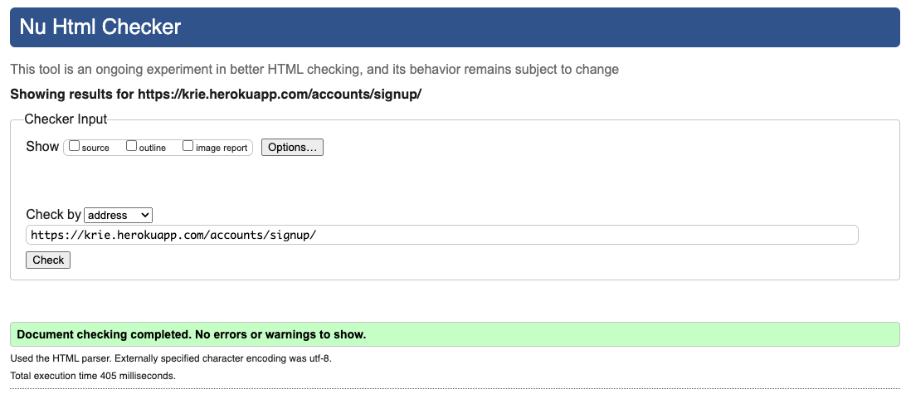
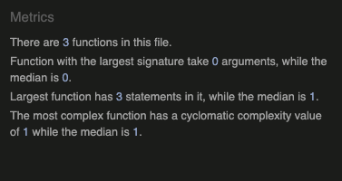

# Table of Contents

- [HTML Validation](#html-validation)
- [CSS Validation](#css-validation)
- [JS Validation](#js-validation)
- [Python Validation](#python-validation)

## HTML Validation

- Homepage

    

- Category page

    - Rooms
    

    - Jobs
    

    - Visas
    

    - Market
    

    - Random
    

- Post detail page

    

- Post create page

    

- Profile page

    - Activity - Posts
    

    - Activity - Comments
    

    - Activity - About
    

    - Edit profile
    

    - Password change
    

- Sign up page

    

- Sign in page

    

- Sign out page

    

- Password reset page

    Previously there was an error as I added class attributes not knowing that Django-allauth already set it.
    

    It has been resolved.
    

[Back To **Table of Contents**](#table-of-contents)

 

## CSS Validation

When passing through the validation for the first time, the validator found 17 errors with `Parse Error`. This was with Bootstrap version 5.2 so I replaced it with a downgrade version(5.1).

All 262 warnings are from the Bootstrap code and the messages are either `Due to their dynamic nature, CSS variables are currently not statically checked`, `-ooo is a vendor extension` or `Same color for background-color and border-color`. These do not affect the site functionality and even support cross-browser compatibility.

[Back To **Table of Contents**](#table-of-contents)

 

## JS Validation

[Back To **Table of Contents**](#table-of-contents)

 

## Python Validation

The project settings script(`krie/settings.py`) contains 5 issues related to the line length. After reading through some conversations on the _Slack_ channel, I decided not to modify the code as they are part of Django's configuration.

[Back To **Table of Contents**](#table-of-contents)